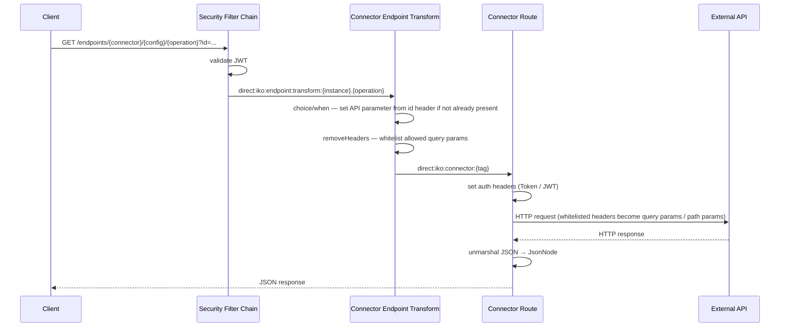

# Connectors

Connectors are Apache Camel route definitions that allow IKO to connect to external systems. Each connector is a reusable template that can be deployed as one or more instances with different configurations.

## Concepts

### Connector

A connector defines *how* to communicate with an external system. It contains a YAML-based Camel route definition (`connectorCode`) that describes HTTP configuration, header mapping, authentication, and parameter handling.

This list contains common connector configuration examples:

- [BAG](./bag.md) -- Basisregistratie Adressen en Gebouwen (addresses and buildings)
- [BRP](./haalcentraal-brp.md) -- Haal Centraal BRP (persons registry)
- [ObjectenAPI](objectenapi.md) -- Objects API
- [OpenDocumenten](opendocumenten.md) -- Open Documenten (document management)
- [OpenKlant](openklant.md) -- Open Klant (customer contacts)
- [OpenZaak](openzaak.md) -- Open Zaak (case management)
- [Demo](demo.md) -- Demo connector with mock data

### Connector Instance

A connector instance is a deployment of a connector with specific configuration. Each instance has its own set of encrypted key-value configuration entries (host, credentials, tokens, etc.) and an optional `apiSpecificationUrl` property for the OpenAPI specification URL.

For example, you might have one "OpenZaak" connector but two instances pointing to different environments (test and production).

The `apiSpecificationUrl` property is stored as a plain-text column on the connector instance. At runtime, it is automatically injected into the `configProperties` variable so Camel routes can reference it as `${variable.configProperties.apiSpecificationUrl}`. Configuration values in the `config` map are stored encrypted in the database using AES-GCM. See [security.md](../security.md) for details.

Typical configuration keys:

| Key | Description |
|---|---|
| `host` | Base URL of the external system |
| `token` / `secret` | API authentication token |
| `clientId` | OAuth2 client ID |
| `clientSecret` | OAuth2 client secret |

### Connector Endpoint

A connector endpoint is a named operation within a connector. It maps to a specific API operation or route. For example, the OpenZaak connector has endpoints like `zaak_list`, `zaak_read`, `zaakinformatieobject_list`.

Endpoints are referenced by `AggregatedDataProfile` and `Relation` entities to define which external operation to call.

### Connector Endpoint Roles

Role-based access control for endpoints. Each role mapping associates a required role with a specific endpoint + instance combination. Users must have the corresponding role in their JWT token to access the endpoint.

## Connector Code (YAML Routes)

Connector code is written in Apache Camel YAML DSL. The route definition typically includes:

- **HTTP endpoint configuration**: Base URL, path, method
- **Header mapping**: Maps Camel exchange headers to HTTP request headers/parameters
- **Authentication**: Token injection or JWT generation (e.g., HS256 for OpenZaak)
- **Parameter filtering**: Whitelisting which headers are forwarded as query parameters

Configuration values from the connector instance are injected using `REFERENCE` placeholders in the YAML route, which are resolved at runtime from the encrypted config store.

## Managing Connectors

Connectors, instances, endpoints, and roles are managed through the admin UI at `/admin/connectors`. The connector code editor uses Monaco for YAML editing with syntax highlighting.

See [api-endpoints.md](../api-endpoints.md) for the full list of connector management HTTP endpoints.

## Route Execution Flow

The following diagram shows the execution sequence for a single connector invocation via the `/endpoints/**` REST API.



## Route Anatomy Reference

The following constructs appear in most connector examples. This section explains what they do.

### `errorHandler: noErrorHandler: {}`

Disables Camel's default per-route error handler. Errors thrown in this route propagate up to IKO's global error handler (`GlobalErrorHandlerConfiguration`), which logs the `correlationId` for tracing and returns a structured error response to the caller. Connector endpoint transform routes should always declare this so errors are handled uniformly.

### Conditional header defaulting (`choice/when`)

Sets a header only if it is not already present on the exchange. Use a `choice/when` block with a `simple` null-check to provide sensible defaults for expected API parameters (path IDs, query parameters) without overwriting values that the caller may have already set.

```yaml
- choice:
    when:
        - simple: "${header.uuid} == null"
          steps:
              - setHeader:
                    name: "uuid"
                    jq:
                        expression: ".idParam // header(\"id\") // empty"
                        source: "variable:endpointTransformContext"
```

`source: "variable:endpointTransformContext"` evaluates the JQ expression against a context variable rather than the exchange body. `header("id")` reads the `id` Camel exchange header — set from the `?id=` query parameter or `/{id}` path variable on the `/endpoints/**` REST API. The final `// empty` produces no output if both are absent, leaving the header unset rather than setting it to null.

### `removeHeaders` with `excludePattern`

Strips all exchange headers except those matching the `excludePattern` pipe-separated list. This is the whitelist of query parameter names the external API accepts. Any headers not in this list — including ones set by earlier routing steps — are removed before the HTTP call so the API does not receive unexpected parameters.

### `script: groovy:` (JWT authentication)

Some APIs (OpenZaak, OpenDocumenten) require a JWT signed with a shared secret instead of a static token. The Groovy script reads `clientSecret` and `clientId` from `configProperties` (loaded from the encrypted connector instance config) and produces a signed HS256 JWT, which is set as the `Authorization: Bearer` header.

### `toD: language:groovy: "rest-openapi:...#${variable.operation}?host=..."`

The `rest-openapi` Camel component reads the OpenAPI specification at `apiSpecificationUrl` to determine the HTTP method, path template, and parameter types for the named operation (`${variable.operation}`). The `host` value overrides the server URL from the spec, allowing one spec to be used against different environments (test, production). The `toD` (dynamic `to`) is used because the full URI is constructed at runtime from exchange variables.

After `rest-openapi` dispatches the HTTP call, headers matching the `excludePattern` from the previous `removeHeaders` step are forwarded as query parameters (for GET operations) or remain available to the component for path parameter substitution.

### `unmarshal: json: {}`

Parses the raw HTTP response bytes into a Jackson `JsonNode` object tree.

// TODO: add information about mandatory routes