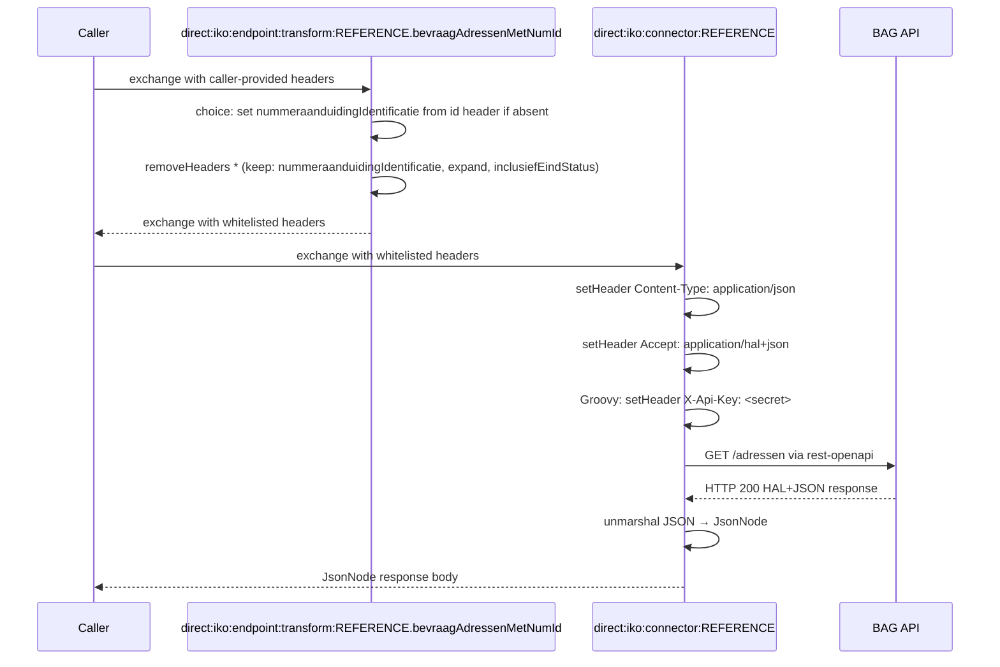

# BAG 

## Configuration

The configuration properties of openzaak are:
- **host**: Base URL
- **secret**: The token to use for authentication

The OpenAPI specification URL is set on the connector instance via the `apiSpecificationUrl` property (e.g. `https://api.bag.kadaster.nl/lvbag/individuelebevragingen/v2/openapi.yaml`).

## Endpoints

BAG has the following endpoints:
- **bevraagAdressenMetNumId**
- **bevraagAdressen**

Other endpoints can be found by inspecting the specification.

## Connector Code

Copy the connector code down below and replace the `REFERENCE` with the refernce of the connector.`

```yaml
- route:
      id: "direct:iko:endpoint:transform:REFERENCE.bevraagAdressenMetNumId"
      errorHandler:
          noErrorHandler: {}
      from:
          uri: "direct:iko:endpoint:transform:REFERENCE.bevraagAdressenMetNumId"
          steps:
              - choice:
                    when:
                        - simple: "${header.nummeraanduidingIdentificatie} == null"
                          steps:
                              - setHeader:
                                    name: "nummeraanduidingIdentificatie"
                                    jq:
                                        expression: ".idParam // header(\"id\") // empty"
                                        source: "variable:endpointTransformContext"
              - removeHeaders:
                    pattern: "*"
                    excludePattern: "nummeraanduidingIdentificatie|expand|inclusiefEindStatus"
- route:
      id: "direct:iko:endpoint:transform:REFERENCE.bevraagAdressen"
      errorHandler:
          noErrorHandler: {}
      from:
          uri: "direct:iko:endpoint:transform:REFERENCE.bevraagAdressen"
          steps:
              - removeHeaders:
                    pattern: "*"
                    excludePattern: "zoekresultaatIdentificatie|postcode|huisnummer|huisnummertoevoeging|huisletter|exacteMatch|adresseerbareObjectIdentificatie|woonplaatsNaam|openbareRuimteNaam|pandIdentificatie|expand|page|pageSize|q|inclusiefEindStatus|openbareRuimteIdentificatie"
- route:
      id: "direct:iko:connector:REFERENCE"
      errorHandler:
          noErrorHandler: {}
      from:
          uri: "direct:iko:connector:REFERENCE"
          steps:
              - setHeader:
                    name: "Content-Type"
                    constant: "application/json"
              - setHeader:
                    name: "Accept"
                    constant: "application/hal+json"
              - script:
                    groovy: |-
                        exchange.in.setHeader("X-Api-Key", "${exchange.getVariable('configProperties', Map).secret}")
              - log: "BODY: ${header.Accept}"
              - toD:
                    uri: "language:groovy:\"rest-openapi:${variable.configProperties.apiSpecificationUrl}#${variable.operation}?host=${variable.configProperties.host}\""
              - unmarshal:
                    json: {}
```

## Route Execution Flow

The diagram below shows the execution flow for a `bevraagAdressenMetNumId` call. The `bevraagAdressen` operation follows the same pattern but skips the conditional identifier step.



## Route anatomy

### Endpoint transform routes

**`choice: set nummeraanduidingIdentificatie if absent`** — Sets the nummeraanduiding identifier required by `bevraagAdressenMetNumId` only when it is not already present. The `choice/when` block checks `${header.nummeraanduidingIdentificatie} == null` and, if true, evaluates the JQ expression `.idParam // header("id") // empty` against the endpoint transform context to default the value from the `id` exchange header (set from the `?id=` query parameter or `/{id}` path variable).

**`removeHeaders`** — Whitelists the query parameters BAG accepts for each operation. See [`removeHeaders`](README.md#removeheaders-with-excludepattern) in the Route Anatomy Reference.

**`errorHandler: noErrorHandler: {}`** — See [`errorHandler`](README.md#errorhandler-noerrorhandler) in the Route Anatomy Reference.

### Connector route

**`setHeader Accept: application/hal+json`** — BAG returns HAL+JSON responses. This header is required for the API to return links alongside data.

**`script: groovy:`** — Sets `X-Api-Key` from the `secret` value in the encrypted connector instance config.

**`toD: language:groovy: "rest-openapi:..."`** — See [`toD: rest-openapi:`](README.md#tod-languagegroovy-rest-openapivariabledoperationhosturl) in the Route Anatomy Reference.