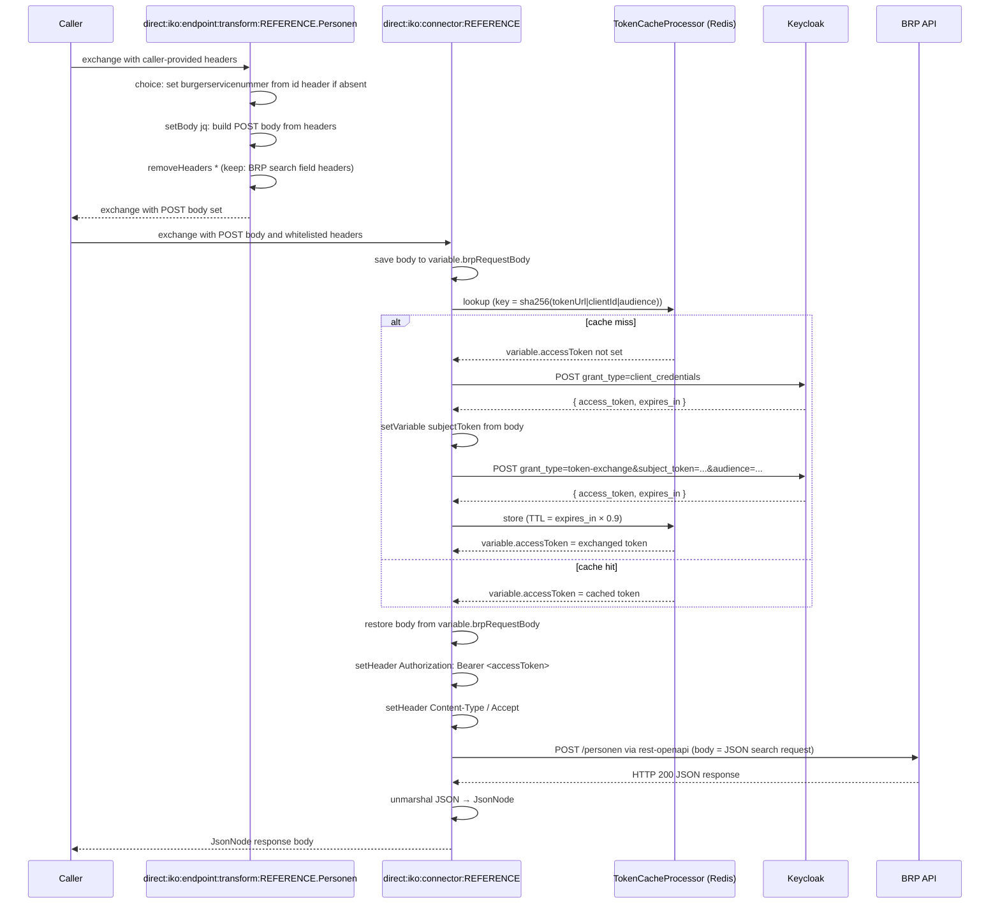

# Haalcentraal BRP (wsGateway)

This connector talks to Haal Centraal BRP through a Keycloak-protected web-service gateway. It performs an inline two-step OAuth2 flow before each BRP call (or short-circuits via a cached access token), then makes the BRP request with the resulting bearer token.

The X-Api-Key variant of the BRP connector is documented in [haalcentraal-brp.md](haalcentraal-brp.md); use this `wsGateway` variant when BRP sits behind a Keycloak token-exchange gateway instead of accepting a static API key.

## Configuration

The connector instance must be configured with the following `configProperties` keys:

| Key | Description | Example |
|---|---|---|
| `host` | Base URL of the BRP API | `https://api.brp.example.nl` |
| `tokenUrl` | Full Keycloak token endpoint | `http://keycloak:8082/auth/realms/valtimo/protocol/openid-connect/token` |
| `clientId` | OAuth2 client ID registered in Keycloak | `iko-brp-client` |
| `clientSecret` | OAuth2 client secret | (encrypted at rest) |
| `audience` | Token-exchange audience | `haalcentraal` |

These values are stored encrypted in the database (AES-GCM) and decrypted into the `configProperties` exchange variable at runtime.

The OpenAPI specification URL is set on the connector instance via the `apiSpecificationUrl` property (a plain-text column on `connector_instance`). Either a remote URL (e.g. `https://developer.rvig.nl/brp-api/personen/_attachments/openapi.yaml`) or a path to a file mounted into the container (e.g. `file:/openapi-specs/haalcentraal-brp-personen.yaml`) is accepted. The repository ships a pre-bundled copy of the BRP spec under [`openapi-specs/`](../../openapi-specs/README.md).

## Local mTLS testing

The `docker-compose.yaml` provides an nginx sidecar (`haalcentraal-personen-mtls`) that wraps the plain-HTTP BRP mock with mTLS on port 8443. The connector's `brp-personen-post` step opts in via `sslContextParameters=%23sslContextParameters`.

### Connector instance config for local mTLS

When the nginx sidecar is up, change the BRP connector instance's `host` config value to:

```
https://haalcentraal-personen-mtls:8443
```

(or `https://localhost:8443` when running IKO via `./gradlew bootRun` on the host). The `apiSpecificationUrl`, `tokenUrl`, `clientId`, `clientSecret`, and `audience` keys stay as they were — only `host` changes.

### Where the certs live

Dev certs are committed under [`certs/`](../../certs/README.md). The `client.jks` and `truststore.jks` are referenced by the global `SSLContextParameters` declared in `application.yml`. Inside docker the IKO container reads them from `/certs/` (via `.env-override.env`); on the host `./gradlew bootRun` reads them from `./certs/`. Both pick up the same files.

### How the opt-in works

The `SSLContextParameters` bean lives in the Camel registry under the name `sslContextParameters`. Any `toD` URI in any connector YAML that needs mTLS appends `?sslContextParameters=%23sslContextParameters` (the `%23` is the URL-encoded `#`). Routes without that query option use plain HTTPS with the JVM default trust store and present no client cert.

## Endpoints

Haalcentraal BRP exposes a single operation in the bundled OpenAPI spec:

- `Personen` — POST search/lookup for natural persons

Other operations may be defined in newer versions of the BRP spec; inspect the OpenAPI document for available `operationId`s.

## Trace log identifiers

Both routes and the meaningful steps inside them carry human-readable `id` values so Camel trace logs and error messages are searchable. The connector route is `REFERENCE-connector` (becomes `connector:REFERENCE:<version>:REFERENCE-connector` after version-namespacing at load time); the endpoint-transform route is `REFERENCE-personen-transform`. Step IDs to watch for: `token-cache-lookup`, `if-token-not-cached`, `keycloak-client-credentials-post`, `extract-subject-token`, `keycloak-token-exchange-post`, `token-cache-store`, `brp-personen-post`. Trivial `setHeader`/`removeHeaders` steps are intentionally unnamed to keep traces concise.

## Token caching

The two-step Keycloak exchange runs on every cache miss. The resulting access token is cached in Redis with TTL = `expires_in × 0.9` (clamped to ≥ 1 s). The cache key is `token:keycloak:<sha256(tokenUrl|clientId|audience)>` so different connector instances and audiences are isolated from each other.

Two log lines indicate cache activity at `DEBUG` level on the `com.ritense.iko.connectors.camel.TokenCacheProcessor` logger:

- `Token cache HIT key='...'` — cached token reused; no Keycloak roundtrip
- `Token cache MISS key='...'` — both Keycloak POSTs ran on this call
- `Token cache PUT key='...' ttlSec='...'` — newly fetched token stored

## Connector Code

Copy the connector code below and replace `REFERENCE` with the connector's tag (e.g. `brp-wsgateway`).

```yaml
- route:
      id: "REFERENCE-personen-transform"
      errorHandler:
          noErrorHandler: {}
      from:
          uri: "direct:iko:endpoint:transform:REFERENCE.Personen"
          steps:
              - choice:
                    id: "default-bsn-from-id-header"
                    when:
                        - simple: "${header.burgerservicenummer} == null"
                          steps:
                              - setHeader:
                                    name: "burgerservicenummer"
                                    jq:
                                        expression: ".idParam // header(\"id\") // empty"
                                        source: "variable:endpointTransformContext"
              - setBody:
                    id: "build-personen-search-body"
                    jq: |
                        {
                           type: (if (header("type") != null) then header("type") else "RaadpleegMetBurgerservicenummer" end),
                           fields: (if (header("fields") != null) then header("fields") | split(",") else ["burgerservicenummer","naam","geboorte","nationaliteiten","verblijfplaats","partners"] end),
                           gemeenteVanInschrijving: header("gemeenteVanInschrijving"),
                           inclusiefOverledenPersonen: header("inclusiefOverledenPersonen"),
                           geboortedatum: header("geboortedatum"),
                           geslachtsnaam: header("geslachtsnaam"),
                           geslacht: header("geslacht"),
                           voorvoegsel: header("voorvoegsel"),
                           voornamen: header("voornamen"),
                           burgerservicenummer: (header("burgerservicenummer") | split(",")),
                           huisletter: header("huisletter"),
                           huisnummer: header("huisnummer"),
                           huisnummertoevoeging: header("huisnummertoevoeging"),
                           postcode: header("postcode"),
                           straat: header("straat"),
                           nummeraanduidingIdentificatie: header("nummeraanduidingIdentificatie"),
                           adresseerbaarObjectIdentificatie: header("adresseerbaarObjectIdentificatie")
                        } | with_entries(select(.value!=null))
              - removeHeaders:
                    id: "whitelist-personen-search-headers"
                    pattern: "*"
                    excludePattern: "type|fields|gemeenteVanInschrijving|inclusiefOverledenPersonen|geboortedatum|geslachtsnaam|geslacht|voorvoegsel|voornamen|burgerservicenummer|huisletter|huisnummer|huisnummertoevoeging|postcode|straat|nummeraanduidingIdentificatie|adresseerbaarObjectIdentificatie"
- route:
      id: "REFERENCE-connector"
      errorHandler:
          noErrorHandler: {}
      from:
          uri: "direct:iko:connector:REFERENCE"
          steps:
              # Preserve the BRP request body that the endpoint-transform built —
              # the token-exchange POSTs below will overwrite it.
              - setVariable:
                    id: "save-brp-request-body"
                    name: "brpRequestBody"
                    simple: "${body}"

              # Cache lookup: sets variable.accessToken on hit, no-op on miss.
              - to:
                    id: "token-cache-lookup"
                    uri: "bean:tokenCacheProcessor?method=lookup"

              - choice:
                    id: "if-token-not-cached"
                    when:
                        - simple: "${variable.accessToken} == null"
                          steps:
                              # Step 1 — client_credentials grant.
                              - removeHeaders:
                                    pattern: "*"
                              - setHeader:
                                    name: "Content-Type"
                                    constant: "application/x-www-form-urlencoded"
                              - setHeader:
                                    name: "CamelHttpMethod"
                                    constant: "POST"
                              - setBody:
                                    id: "build-client-credentials-body"
                                    simple: "grant_type=client_credentials&client_id=${variable.configProperties[clientId]}&client_secret=${variable.configProperties[clientSecret]}"
                              - toD:
                                    id: "keycloak-client-credentials-post"
                                    uri: "language:groovy:\"${variable.configProperties.tokenUrl}?bridgeEndpoint=true\""
                              - unmarshal:
                                    json: {}
                              - setVariable:
                                    id: "extract-subject-token"
                                    name: "subjectToken"
                                    simple: "${body[access_token]}"

                              # Step 2 — legacy token-exchange grant.
                              - removeHeaders:
                                    pattern: "*"
                              - setHeader:
                                    name: "Content-Type"
                                    constant: "application/x-www-form-urlencoded"
                              - setHeader:
                                    name: "CamelHttpMethod"
                                    constant: "POST"
                              - setBody:
                                    id: "build-token-exchange-body"
                                    simple: "grant_type=urn:ietf:params:oauth:grant-type:token-exchange&client_id=${variable.configProperties[clientId]}&client_secret=${variable.configProperties[clientSecret]}&subject_token=${variable.subjectToken}&requested_token_type=urn:ietf:params:oauth:token-type:access_token&audience=${variable.configProperties[audience]}"
                              - toD:
                                    id: "keycloak-token-exchange-post"
                                    uri: "language:groovy:\"${variable.configProperties.tokenUrl}?bridgeEndpoint=true\""
                              - unmarshal:
                                    json: {}

                              # Cache store: reads access_token + expires_in from
                              # the unmarshalled body, writes to Redis with TTL =
                              # expires_in × 0.9, sets variable.accessToken.
                              - to:
                                    id: "token-cache-store"
                                    uri: "bean:tokenCacheProcessor?method=store"

              # Restore the BRP request body the endpoint-transform built.
              - setBody:
                    id: "restore-brp-request-body"
                    simple: "${variable.brpRequestBody}"
              - removeHeaders:
                    pattern: "*"
              - setHeader:
                    name: "Authorization"
                    simple: "Bearer ${variable.accessToken}"
              - setHeader:
                    name: "Content-Type"
                    constant: "application/json"
              - setHeader:
                    name: "Accept"
                    constant: "application/json; charset=utf-8"
              - toD:
                    id: "brp-personen-post"
                    uri: "language:groovy:\"rest-openapi:${variable.configProperties.apiSpecificationUrl}#${variable.operation}?host=${variable.configProperties.host}&sslContextParameters=%23sslContextParameters\""
              - unmarshal:
                    json: {}
```

## Route Execution Flow

BRP wsGateway differs from the X-Api-Key variant: it performs an inline two-step OAuth2 flow against Keycloak before each BRP call, with caching to avoid the round-trip on warm calls.



## Route anatomy

### Endpoint transform route

Identical in shape to the X-Api-Key BRP connector: a `choice/when` defaults `burgerservicenummer` from the `id` header, a `setBody: jq:` block constructs the JSON POST body the BRP API expects, and `removeHeaders` strips headers that are not BRP search fields. See the [BRP X-Api-Key page](haalcentraal-brp.md#endpoint-transform-route) for a step-by-step breakdown of the JQ expression.

### Connector route

**`setVariable brpRequestBody`** — Stores the JSON body built by the endpoint transform. The token-exchange POSTs below overwrite the body; this lets us restore it before the BRP call.

**`to: "bean:tokenCacheProcessor?method=lookup"`** — Invokes the `TokenCacheProcessor` Spring bean. On a Redis hit, the bean sets `variable.accessToken` to the cached token; on a miss it is a no-op. The bean reads `tokenUrl`, `clientId`, and `audience` from `configProperties` to compute the cache key.

**`choice/when: ${variable.accessToken} == null`** — Runs the two-step Keycloak flow only when no cached token is available.

**Step 1 — `client_credentials` grant** — A standard OAuth2 client-credentials POST. The response is unmarshalled to a `LinkedHashMap` (Camel's default `unmarshal: json: {}` behavior) and the `access_token` is extracted into `variable.subjectToken` via Camel Simple bracket notation `${body[access_token]}`. The same Map-vs-method note as for `configProperties` applies: bracket form is required because Simple's `.access_token` would try to invoke a method on the Map. This token will be the `subject_token` for step 2; it is never used directly to call BRP.

**Step 2 — token-exchange grant** — A `grant_type=urn:ietf:params:oauth:grant-type:token-exchange` POST with `subject_token` from step 1 and `audience` from config. Keycloak returns an audience-scoped access token. The unmarshalled response is left on the exchange body for the next step.

**`to: "bean:tokenCacheProcessor?method=store"`** — Reads `access_token` and `expires_in` from the unmarshalled body, writes the token to Redis with TTL = `expires_in × 0.9` (clamped to ≥ 1 s), and sets `variable.accessToken` so the rest of the route uses it.

**Map key access in Simple vs Groovy** — The two `setBody` steps above use bracket notation `${variable.configProperties[clientId]}` because Camel's Simple language OGNL treats `.clientId` as a method invocation on the `LinkedHashMap` (which fails with `Method with name: clientId not found`). The `toD` URI lines further down are wrapped in `language:groovy:"..."` and so use the dot form `${variable.configProperties.tokenUrl}` because Groovy's `.` operator does Map-property access.

**`setBody simple: "${variable.brpRequestBody}"`** — Restores the BRP search body that the endpoint-transform built. `removeHeaders pattern: "*"` immediately after clears the OAuth-related headers so they do not leak into the BRP request.

**`setHeader Authorization: Bearer ${variable.accessToken}`** — Sets the bearer token for the BRP call.

**`toD: language:groovy: "rest-openapi:..."`** — Same dispatch pattern as the rest of the codebase: `rest-openapi` reads the OpenAPI spec at `apiSpecificationUrl`, resolves the operation, and uses the exchange body as the HTTP request body.

**`unmarshal: json: {}`** — Parses the BRP response into a Jackson `JsonNode` tree.

---

If you want to log the response body, add the following step before `unmarshal` in the connector route:

```yaml
              - log: "BODY: ${body}"
```
