# Haalcentraal BRP

## Configuration

The configuration properties of openzaak are:
- **host**: Base URL
- **secret**: The token to use for authentication

The OpenAPI specification URL is set on the connector instance via the `apiSpecificationUrl` property (e.g. `https://developer.rvig.nl/brp-api/personen/_attachments/openapi.yaml`).

## Endpoints

Haalcentraal BRP has the following endpoints:
- Personen 

Other endpoints can be found by inspecting the specification.

## Connector Code

Copy the connector code down below and replace the `REFERENCE` with the refernce of the connector.`

```yaml
- route:
      id: "direct:iko:endpoint:transform:REFERENCE.Personen"
      errorHandler:
          noErrorHandler: {}
      from:
          uri: "direct:iko:endpoint:transform:REFERENCE.Personen"
          steps:
              - choice:
                    when:
                        - simple: "${header.burgerservicenummer} == null"
                          steps:
                              - setHeader:
                                    name: "burgerservicenummer"
                                    jq:
                                        expression: ".idParam // header(\"id\") // empty"
                                        source: "variable:endpointTransformContext"
              - setBody:
                    jq: |
                        {
                           type: (if (header("type") != null) then header("type") else "RaadpleegMetBurgerservicenummer" end),
                           fields: (if (header("fields") != null) then header("fields") | split(",") else ["burgerservicenummer","naam","geboorte","nationaliteiten","verblijfplaats","partners"] end),
                           gemeenteVanInschrijving: header("gemeenteVanInschrijving"),
                           inclusiefOverledenPersonen: header("inclusiefOverledenPersonen"),
                           geboortedatum: header("geboortedatum"),
                           geslachtsnaam: header("geslachtsnaam"),
                           geslacht: header("geslacht"),
                           voorvoegsel: header("voorvoegsel"),
                           voornamen: header("voornamen"),
                           burgerservicenummer: (header("burgerservicenummer") | split(",")),
                           huisletter: header("huisletter"),
                           huisnummer: header("huisnummer"),
                           huisnummertoevoeging: header("huisnummertoevoeging"),
                           postcode: header("postcode"),
                           straat: header("straat"),
                           nummeraanduidingIdentificatie: header("nummeraanduidingIdentificatie"),
                           adresseerbaarObjectIdentificatie: header("adresseerbaarObjectIdentificatie")
                        } | with_entries(select(.value!=null))
              - removeHeaders:
                    pattern: "*"
                    excludePattern: "type|fields|gemeenteVanInschrijving|inclusiefOverledenPersonen|geboortedatum|geslachtsnaam|geslacht|voorvoegsel|voornamen|burgerservicenummer|huisletter|huisnummer|huisnummertoevoeging|postcode|straat|nummeraanduidingIdentificatie|adresseerbaarObjectIdentificatie"
- route:
      id: "direct:iko:connector:REFERENCE"
      errorHandler:
          noErrorHandler: {}
      from:
          uri: "direct:iko:connector:REFERENCE"
          steps:
              - setHeader:
                    name: "Content-Type"
                    constant: "application/json"
              - setHeader:
                    name: "Accept"
                    constant: "application/json; charset=utf-8"
              - script:
                    groovy: |-
                        exchange.in.setHeader("X-Api-Key", "${exchange.getVariable('configProperties', Map).secret}")
              - log: "BODY: ${header.Accept}"
              - toD:
                    uri: "language:groovy:\"rest-openapi:${variable.configProperties.apiSpecificationUrl}#${variable.operation}?host=${variable.configProperties.host}\""
              - unmarshal:
                    json: {}
```

## Route Execution Flow

BRP differs from most connectors: it uses a **POST body** instead of query parameters. The endpoint transform route constructs the JSON body from headers rather than whitelisting headers for a GET request.

```mermaid
sequenceDiagram
    participant Caller
    participant XfmPers as direct:iko:endpoint:transform:REFERENCE.Personen
    participant Conn as direct:iko:connector:REFERENCE
    participant BRP as BRP API

    Caller->>XfmPers: exchange with caller-provided headers
    XfmPers->>XfmPers: choice: set burgerservicenummer from id header if absent
    XfmPers->>XfmPers: setBody jq: build POST body from headers<br/>(type, fields, burgerservicenummer, search fields)
    XfmPers->>XfmPers: removeHeaders * (keep: BRP search field headers)
    XfmPers-->>Caller: exchange with POST body set and headers whitelisted
    Caller->>Conn: exchange with POST body and whitelisted headers
    Conn->>Conn: setHeader Content-Type: application/json
    Conn->>Conn: setHeader Accept: application/json&#59; charset=utf-8
    Conn->>Conn: Groovy: setHeader X-Api-Key: <secret>
    Conn->>BRP: POST /personen via rest-openapi (body = JSON search request)
    BRP-->>Conn: HTTP 200 JSON response
    Conn->>Conn: unmarshal JSON → JsonNode
    Conn-->>Caller: JsonNode response body
```



## Route anatomy

### Endpoint transform route

**`choice: set burgerservicenummer if absent`** — Sets the BSN to look up as a header only when it is not already present. The `choice/when` block checks `${header.burgerservicenummer} == null` and, if true, evaluates the JQ expression `.idParam // header("id") // empty` against the endpoint transform context to default the value from the `id` exchange header (set from the `?id=` query parameter or `/{id}` path variable).

**`setBody: jq:`** — Constructs the JSON POST body the BRP API expects. The JQ expression:
- Defaults `type` to `RaadpleegMetBurgerservicenummer` if not provided by the caller
- Defaults `fields` to a standard set if not provided
- Reads `burgerservicenummer` from the header (set by the preceding `choice` block when absent) and splits comma-separated values into a JSON array
- Reads all other BRP search fields from headers
- `with_entries(select(.value!=null))` strips null fields so the API does not receive empty parameters

**`removeHeaders`** — Strips exchange headers after the body is built to prevent them from being forwarded as query parameters on the POST request. See [`removeHeaders`](README.md#removeheaders-with-excludepattern) in the Route Anatomy Reference.

**`errorHandler: noErrorHandler: {}`** — See [`errorHandler`](README.md#errorhandler-noerrorhandler) in the Route Anatomy Reference.

### Connector route

**`script: groovy:`** — Sets `X-Api-Key` from the `secret` value in the encrypted connector instance config.

**`toD: language:groovy: "rest-openapi:..."`** — Uses the BRP OpenAPI spec to dispatch the POST request. The `rest-openapi` component uses the exchange body as the HTTP request body. See [`toD: rest-openapi:`](README.md#tod-languagegroovy-rest-openapivariabledoperationhosturl) in the Route Anatomy Reference.

---

If you want to output the response body to the console log, add the following line to the second route of the connector at the same level of `- unmarshal:`:
```yaml
              - log: "BODY: ${body}"
```