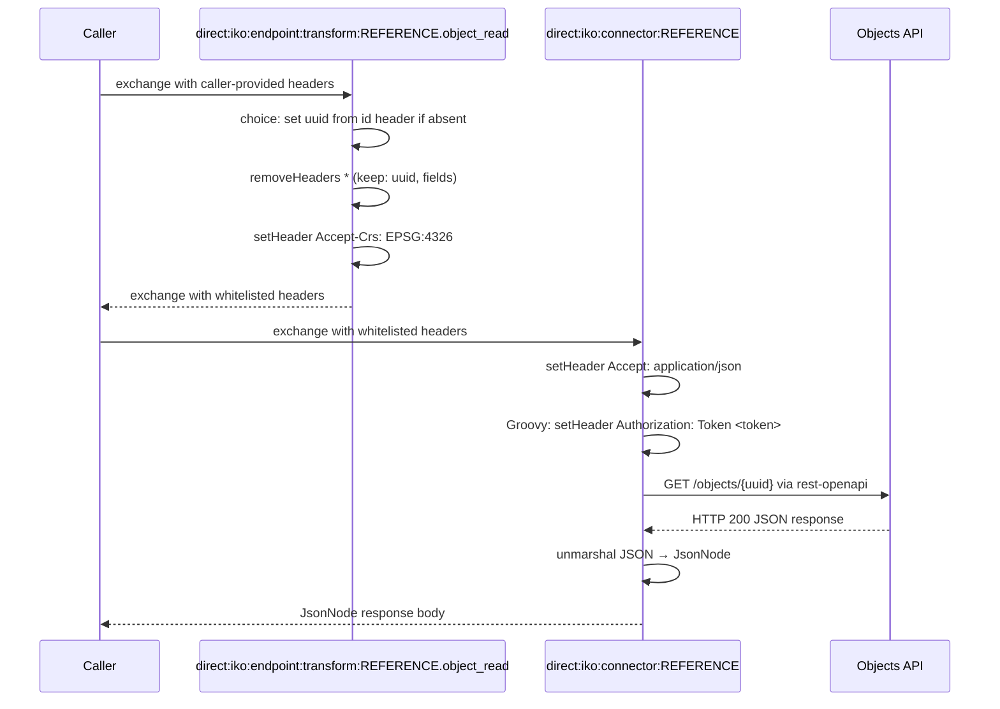

# Objecten API

## Configuration

The configuration properties of the objecten api are:
- **host**: Base URL
- **token**: The token to use for authentication

The OpenAPI specification URL is set on the connector instance via the `apiSpecificationUrl` property.

## Endpoints

The objecten api has the following endpoints:
- **object_list**: Get a list of objects
- **object_read**: Get a single object

Other endpoints can be found by inspecting the specification.

## Connector Code

Copy the connector code down below and replace the `REFERENCE` with the refernce of the connector.`

```yaml
- route:
      id: "direct:iko:endpoint:transform:REFERENCE.object_list"
      errorHandler:
          noErrorHandler: {}
      from:
          uri: "direct:iko:endpoint:transform:REFERENCE.object_list"
          steps:
              - removeHeaders:
                    pattern: "*"
                    excludePattern: "data_attrs|data_attr|date|fields|ordering|page|pageSize|registrationDate|type"
              - setHeader:
                    name: "Accept-Crs"
                    constant: "EPSG:4326"
- route:
      id: "direct:iko:endpoint:transform:REFERENCE.object_read"
      errorHandler:
          noErrorHandler: {}
      from:
          uri: "direct:iko:endpoint:transform:REFERENCE.object_read"
          steps:
              - choice:
                    when:
                        - simple: "${header.uuid} == null"
                          steps:
                              - setHeader:
                                    name: "uuid"
                                    jq:
                                        expression: ".idParam // header(\"id\") // empty"
                                        source: "variable:endpointTransformContext"
              - removeHeaders:
                    pattern: "*"
                    excludePattern: "uuid|fields"
              - setHeader:
                    name: "Accept-Crs"
                    constant: "EPSG:4326"
- route:
      id: "direct:iko:connector:REFERENCE"
      errorHandler:
        noErrorHandler: {}
      from:
          uri: "direct:iko:connector:REFERENCE"
          steps:
              - setHeader:
                    name: "Accept"
                    constant: "application/json"
              - script:
                    groovy: |-
                        exchange.in.setHeader("Authorization", "Token ${exchange.getVariable('configProperties', Map).token}")
              - toD:
                    uri: "language:groovy:\"rest-openapi:${variable.configProperties.apiSpecificationUrl}#${variable.operation}?host=${variable.configProperties.host}\""
              - unmarshal:
                    json: {}
```

## Route Execution Flow

The diagram below shows the execution flow for an `object_read` call. The `object_list` operation follows the same pattern but skips the `setHeaderIfAbsent` step.



## Route anatomy

### Endpoint transform routes

**`choice: set uuid if absent`** — Sets the `uuid` path parameter required for single-object lookup (`object_read`) only when it is not already present. The `choice/when` block checks `${header.uuid} == null` and, if true, evaluates the JQ expression `.idParam // header("id") // empty` against the endpoint transform context to default `uuid` from the `id` exchange header (set from the `?id=` query parameter or `/{id}` path variable).

**`removeHeaders`** — Whitelists the query parameters the Objects API accepts for each operation. See [`removeHeaders`](README.md#removeheaders-with-excludepattern) in the Route Anatomy Reference.

**`setHeader Accept-Crs: EPSG:4326`** — The Objects API returns geographic data; this header requests WGS84 coordinates in the response.

**`errorHandler: noErrorHandler: {}`** — See [`errorHandler`](README.md#errorhandler-noerrorhandler) in the Route Anatomy Reference.

### Connector route

**`script: groovy:`** — Sets `Authorization: Token <token>` using the `token` value from the encrypted connector instance config.

**`toD: language:groovy: "rest-openapi:..."`** — See [`toD: rest-openapi:`](README.md#tod-languagegroovy-rest-openapivariabledoperationhosturl) in the Route Anatomy Reference.