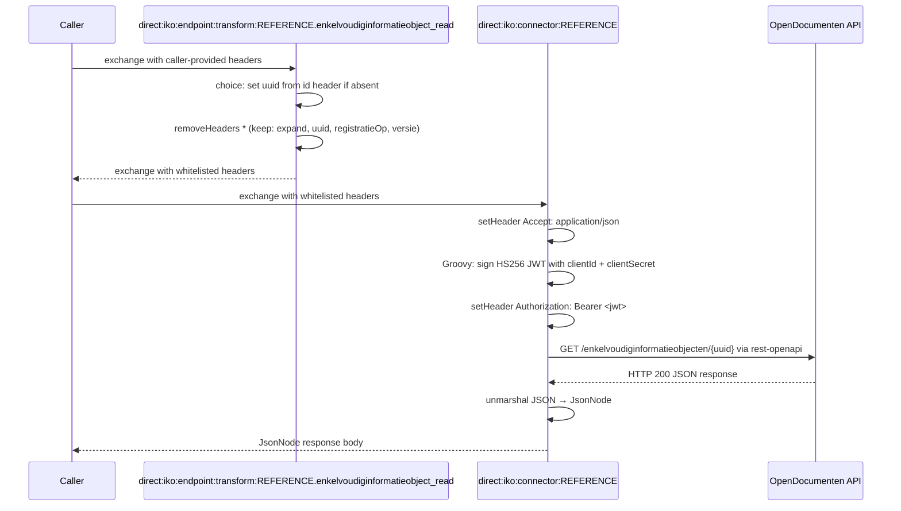

# Opendocumenten 

## Configuration

The configuration properties of opendocumenten are:
- **host**: Base URL
- **clientId**: The token to use for authentication
- **clientSecret**: The secret to use for authentication

The OpenAPI specification URL is set on the connector instance via the `apiSpecificationUrl` property.

## Endpoints

Has the following endpoints:
- enkelvoudiginformatieobject_list
- enkelvoudiginformatieobject_read

Other endpoints can be found by inspecting the specification.

## Connector Code

Copy the connector code down below and replace the `REFERENCE` with the refernce of the connector.`

```yaml
- route:
      id: "direct:iko:endpoint:transform:REFERENCE.enkelvoudiginformatieobject_list" 
      errorHandler:
          noErrorHandler: {}
      from:
          uri: "direct:iko:endpoint:transform:REFERENCE.enkelvoudiginformatieobject_list"
          steps:
              - removeHeaders:
                    pattern: "*"
                    excludePattern: "auteur|beschrijving|bronorganisatie|creatiedatum__gte|creatiedatum__lte|expand|identificatie|informatieobjecttype|locked|objectinformatieobjecten__object|objectinformatieobjecten__objectType|ordering|page|pageSize|titel|trefwoorden|trefwoorden__overlap|vertrouwelijkheidaanduiding"
- route:
      id: "direct:iko:endpoint:transform:REFERENCE.enkelvoudiginformatieobject_read"
      errorHandler:
          noErrorHandler: {}
      from:
          uri: "direct:iko:endpoint:transform:REFERENCE.enkelvoudiginformatieobject_read"
          steps:
              - choice:
                    when:
                        - simple: "${header.uuid} == null"
                          steps:
                              - setHeader:
                                    name: "uuid"
                                    jq:
                                        expression: ".idParam // header(\"id\") // empty"
                                        source: "variable:endpointTransformContext"
              - removeHeaders:
                    pattern: "*"
                    excludePattern: "expand|uuid|registratieOp|versie"
- route:
      id: "direct:iko:connector:REFERENCE"
      errorHandler:
          noErrorHandler: {}
      from:
          uri: "direct:iko:connector:REFERENCE"
          steps:
              - setHeader:
                    name: "Accept"
                    constant: "application/json"
              - script:
                    groovy: |-
                        def signingKey = io.jsonwebtoken.security.Keys.hmacShaKeyFor(variable.configProperties.clientSecret.getBytes());

                        def jwt = io.jsonwebtoken.Jwts.builder()
                              .issuer(variable.configProperties.clientId)
                              .issuedAt(new Date())
                              .claim("client_id", variable.configProperties.clientId)
                              .signWith(signingKey, io.jsonwebtoken.SignatureAlgorithm.HS256)
                              .compact();

                        exchange.in.setHeader("Authorization", "Bearer ${jwt}");
              - toD:
                    uri: "language:groovy:\"rest-openapi:${variable.configProperties.apiSpecificationUrl}#${variable.operation}?host=${variable.configProperties.host}\""
              - unmarshal:
                    json: {}
```

## Route Execution Flow

The diagram below shows the execution flow for an `enkelvoudiginformatieobject_read` call. The list operation follows the same pattern but skips the conditional `uuid` step.



## Route anatomy

### Endpoint transform routes

**`choice: set uuid if absent`** — Sets the `uuid` path parameter required for single-document lookup (`enkelvoudiginformatieobject_read`) only when it is not already present. The `choice/when` block checks `${header.uuid} == null` and, if true, evaluates the JQ expression `.idParam // header("id") // empty` against the endpoint transform context to default `uuid` from the `id` exchange header (set from the `?id=` query parameter or `/{id}` path variable).

**`removeHeaders`** — Whitelists the query parameters OpenDocumenten accepts for each operation. See [`removeHeaders`](README.md#removeheaders-with-excludepattern) in the Route Anatomy Reference.

**`errorHandler: noErrorHandler: {}`** — See [`errorHandler`](README.md#errorhandler-noerrorhandler) in the Route Anatomy Reference.

### Connector route

**`script: groovy:`** — OpenDocumenten uses the same HS256-signed JWT mechanism as OpenZaak. The script reads `clientId` and `clientSecret` from the encrypted connector instance config and builds a signed JWT set as `Authorization: Bearer`. See [`script: groovy:`](README.md#script-groovy-jwt-authentication) in the Route Anatomy Reference.

**`toD: language:groovy: "rest-openapi:..."`** — See [`toD: rest-openapi:`](README.md#tod-languagegroovy-rest-openapivariabledoperationhosturl) in the Route Anatomy Reference.