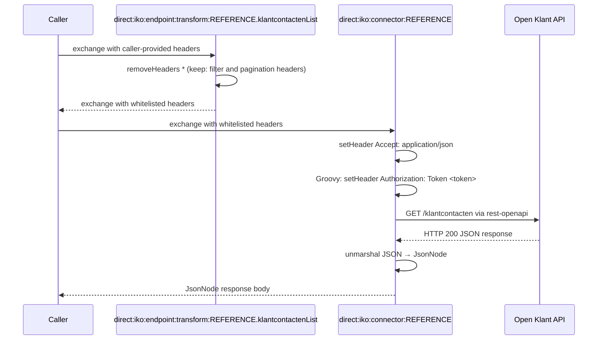

# Openklant

## Configuration

The configuration properties of the objecten api are:
- **host**: Base URL
- **token**: The token to use for authentication

The OpenAPI specification URL is set on the connector instance via the `apiSpecificationUrl` property.

## Endpoints

Openklant has the following endpoints:
- klantcontactenList
- actorenList

Other endpoints can be found by inspecting the specification.

## Connector Code

Copy the connector code down below and replace the `REFERENCE` with the refernce of the connector.`

```yaml
- route:
      id: "direct:iko:endpoint:transform:REFERENCE.klantcontactenList"
      from:
          uri: "direct:iko:endpoint:transform:REFERENCE.klantcontactenList"
          steps:
              - removeHeaders:
                    pattern: "*"
                    excludePattern: "expand|hadBetrokkene__url|hadBetrokkene__uuid|hadBetrokkene__wasPartij__partijIdentificator__codeObjecttype|hadBetrokkene__wasPartij__partijIdentificator__codeRegister|hadBetrokkene__wasPartij__partijIdentificator__codeSoortObjectId|hadBetrokkene__wasPartij__partijIdentificator__objectId|hadBetrokkene__wasPartij__url|hadBetrokkene__wasPartij__uuid|indicatieContactGelukt|inhoud|kanaal|nummer|onderwerp|onderwerpobject__onderwerpobjectidentificatorCodeObjecttype|onderwerpobject__onderwerpobjectidentificatorCodeRegister|onderwerpobject__onderwerpobjectidentificatorCodeSoortObjectId|onderwerpobject__onderwerpobjectidentificatorObjectId|onderwerpobject__url|onderwerpobject__uuid|page|pageSize|plaatsgevondenOp|vertrouwelijk|wasOnderwerpobject__onderwerpobjectidentificatorCodeObjecttype|wasOnderwerpobject__onderwerpobjectidentificatorCodeRegister|wasOnderwerpobject__onderwerpobjectidentificatorCodeSoortObjectId|wasOnderwerpobject__onderwerpobjectidentificatorObjectId|wasOnderwerpobject__url|wasOnderwerpobject__uuid"
- route:
      id: "direct:iko:endpoint:transform:REFERENCE.actorenList"
      from:
          uri: "direct:iko:endpoint:transform:REFERENCE.actorenList"
          steps:
              - removeHeaders:
                    pattern: "*"
                    excludePattern: "actoridentificatorCodeObjecttype|actoridentificatorCodeRegister|actoridentificatorCodeSoortObjectId|actoridentificatorObjectId|indicatieActief|naam|page|pageSize|soortActor"
- route:
      id: "direct:iko:connector:REFERENCE"
      errorHandler:
          noErrorHandler: {}
      from:
          uri: "direct:iko:connector:REFERENCE"
          steps:
              - setHeader:
                    name: "Accept"
                    constant: "application/json"
              - script:
                    groovy: |-
                        exchange.in.setHeader("Authorization", "Token ${exchange.getVariable('configProperties', Map).token}")
              - toD:
                    uri: "language:groovy:\"rest-openapi:${variable.configProperties.apiSpecificationUrl}#${variable.operation}?host=${variable.configProperties.host}\""
              - unmarshal:
                    json: {}
```

## Route Execution Flow

Both endpoints are list operations — there is no single-resource lookup and no `setHeaderIfAbsent` step.



## Route anatomy

### Endpoint transform routes

These routes only perform whitelisting — both endpoints are list operations with no single-resource lookup, so no `setHeaderIfAbsent` step is needed.

**`removeHeaders`** — Whitelists the filter and pagination parameters accepted by each Open Klant endpoint. See [`removeHeaders`](README.md#removeheaders-with-excludepattern) in the Route Anatomy Reference.

Note: the `klantcontactenList` and `actorenList` routes do not declare `errorHandler: noErrorHandler: {}`. Add this for consistency with other connector endpoint transform routes so errors are handled uniformly by IKO's global error handler. See [`errorHandler`](README.md#errorhandler-noerrorhandler) in the Route Anatomy Reference.

### Connector route

**`script: groovy:`** — Sets `Authorization: Token <token>` using the `token` value from the encrypted connector instance config.

**`toD: language:groovy: "rest-openapi:..."`** — See [`toD: rest-openapi:`](README.md#tod-languagegroovy-rest-openapivariabledoperationhosturl) in the Route Anatomy Reference.