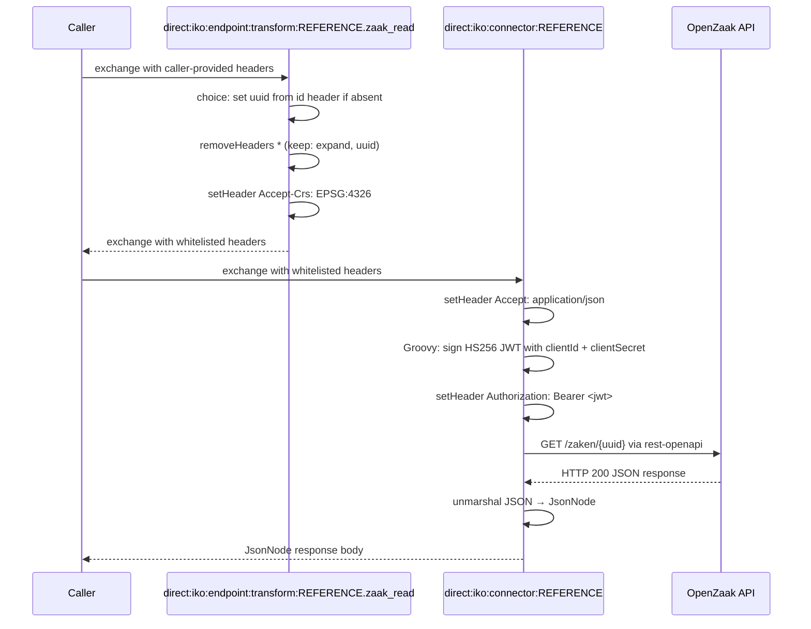

# Openzaak

## Configuration

The configuration properties of openzaak are:
- **host**: Base URL
- **clientId**: The token to use for authentication
- **clientSecret**: The secret to use for authentication

The OpenAPI specification URL is set on the connector instance via the `apiSpecificationUrl` property.

## Endpoints

Openzaak has the following endpoints:
- zaak_list
- zaak_read
- zaakinformatieobject_list
- zaakinformatieobject_read

Other endpoints can be found by inspecting the specification.

## Connector Code

Copy the connector code down below and replace the `REFERENCE` with the refernce of the connector.`

```yaml
- route:
      id: "direct:iko:endpoint:transform:REFERENCE.zaakinformatieobject_read"
      errorHandler:
          noErrorHandler: {}
      from:
          uri: "direct:iko:endpoint:transform:REFERENCE.zaakinformatieobject_read"
          steps:
              - choice:
                    when:
                        - simple: "${header.uuid} == null"
                          steps:
                              - setHeader:
                                    name: "uuid"
                                    jq:
                                        expression: ".idParam // header(\"id\") // empty"
                                        source: "variable:endpointTransformContext"
              - removeHeaders:
                    pattern: "*"
                    excludePattern: "uuid"
- route:
      id: "direct:iko:endpoint:transform:REFERENCE.zaakinformatieobject_list"
      errorHandler:
          noErrorHandler: {}
      from:
          uri: "direct:iko:endpoint:transform:REFERENCE.zaakinformatieobject_list"
          steps:
              - removeHeaders:
                    pattern: "*"
                    excludePattern: "informatieobject|zaak"
- route:
      id: "direct:iko:endpoint:transform:REFERENCE.zaak_list" 
      errorHandler:
          noErrorHandler: {}
      from:
          uri: "direct:iko:endpoint:transform:REFERENCE.zaak_list"
          steps:
              - removeHeaders:
                    pattern: "*"
                    excludePattern: "archiefactiedatum|archiefactiedatum__gt|archiefactiedatum__isnull|archiefactiedatum__lt|archiefnominatie|archiefnominatie__in|archiefstatus|archiefstatus__in|bronorganisatie|bronorganisatie__in|einddatum|einddatumGepland|einddatumGepland__gt|einddatumGepland__lt|einddatum__gt|einddatum__isnull|einddatum__lt|expand|identificatie|maximaleVertrouwelijkheidaanduiding|ordering|page|registratiedatum|registratiedatum__gt|registratiedatum__lt|rol__betrokkene|rol__betrokkeneIdentificatie__medewerker__identificatie|rol__betrokkeneIdentificatie__natuurlijkPersoon__anpIdentificatie|rol__betrokkeneIdentificatie__natuurlijkPersoon__inpA_nummer|rol__betrokkeneIdentificatie__natuurlijkPersoon__inpBsn|rol__betrokkeneIdentificatie__nietNatuurlijkPersoon__annIdentificatie|rol__betrokkeneIdentificatie__nietNatuurlijkPersoon__innNnpId|rol__betrokkeneIdentificatie__organisatorischeEenheid__identificatie|rol__betrokkeneIdentificatie__vestiging__vestigingsNummer|rol__betrokkeneType|rol__omschrijvingGeneriek|startdatum|startdatum__gt|startdatum__gte|startdatum__lt|startdatum__lte|uiterlijkeEinddatumAfdoening|uiterlijkeEinddatumAfdoening__gt|uiterlijkeEinddatumAfdoening__lt|zaaktype"
              - setHeader:
                    name: "Accept-Crs"
                    constant: "EPSG:4326"
- route:
      id: "direct:iko:endpoint:transform:REFERENCE.zaak_read"
      errorHandler:
          noErrorHandler: {}
      from:
          uri: "direct:iko:endpoint:transform:REFERENCE.zaak_read"
          steps:
              - choice:
                    when:
                        - simple: "${header.uuid} == null"
                          steps:
                              - setHeader:
                                    name: "uuid"
                                    jq:
                                        expression: ".idParam // header(\"id\") // empty"
                                        source: "variable:endpointTransformContext"
              - removeHeaders:
                    pattern: "*"
                    excludePattern: "expand|uuid"
              - setHeader:
                    name: "Accept-Crs"
                    constant: "EPSG:4326"
- route:
      id: "direct:iko:connector:REFERENCE"
      errorHandler:
          noErrorHandler: {}
      from:
          uri: "direct:iko:connector:REFERENCE"
          steps:
              - setHeader:
                    name: "Accept"
                    constant: "application/json"
              - script:
                    groovy: |-
                        def signingKey = io.jsonwebtoken.security.Keys.hmacShaKeyFor(variable.configProperties.clientSecret.getBytes());

                        def jwt = io.jsonwebtoken.Jwts.builder()
                              .issuer(variable.configProperties.clientId)
                              .issuedAt(new Date())
                              .claim("client_id", variable.configProperties.clientId)
                              .signWith(signingKey, io.jsonwebtoken.SignatureAlgorithm.HS256)
                              .compact();

                        exchange.in.setHeader("Authorization", "Bearer ${jwt}");
              - toD:
                    uri: "language:groovy:\"rest-openapi:${variable.configProperties.apiSpecificationUrl}#${variable.operation}?host=${variable.configProperties.host}\""
              - unmarshal:
                    json: {}

```

## Route Execution Flow

The diagram below shows the execution flow for a `zaak_read` call. List operations follow the same pattern but skip the conditional `uuid` step.



## Route anatomy

### Endpoint transform routes

Each endpoint transform route handles one operation. The routes prepare the exchange headers before the connector route makes the HTTP call.

**`choice: set uuid if absent`** — Sets the `uuid` path parameter required by OpenZaak for single-resource lookups (`zaak_read`, `zaakinformatieobject_read`) only when it is not already present. The `choice/when` block checks `${header.uuid} == null` and, if true, evaluates the JQ expression `.idParam // header("id") // empty` against the endpoint transform context to default `uuid` from the `id` exchange header (set from the `?id=` query parameter or `/{id}` path variable).

**`removeHeaders`** — Whitelists the query parameters OpenZaak accepts for each operation. Any exchange headers not in `excludePattern` are stripped so the HTTP call does not send unexpected parameters. See [`removeHeaders`](README.md#removeheaders-with-excludepattern) in the Route Anatomy Reference.

**`setHeader Accept-Crs: EPSG:4326`** — OpenZaak returns geographic coordinates; this header tells the API which coordinate reference system to use in the response.

**`errorHandler: noErrorHandler: {}`** — See [`errorHandler`](README.md#errorhandler-noerrorhandler) in the Route Anatomy Reference.

### Connector route

**`script: groovy:`** — OpenZaak uses HS256-signed JWTs for authentication. The script reads `clientId` and `clientSecret` from the encrypted connector instance config (`configProperties`) and builds a signed JWT set as `Authorization: Bearer`. See [`script: groovy:`](README.md#script-groovy-jwt-authentication) in the Route Anatomy Reference.

**`toD: language:groovy: "rest-openapi:..."`** — Dynamically constructs the URI from `apiSpecificationUrl` and `host` at runtime. See [`toD: rest-openapi:`](README.md#tod-languagegroovy-rest-openapivariabledoperationhosturl) in the Route Anatomy Reference.