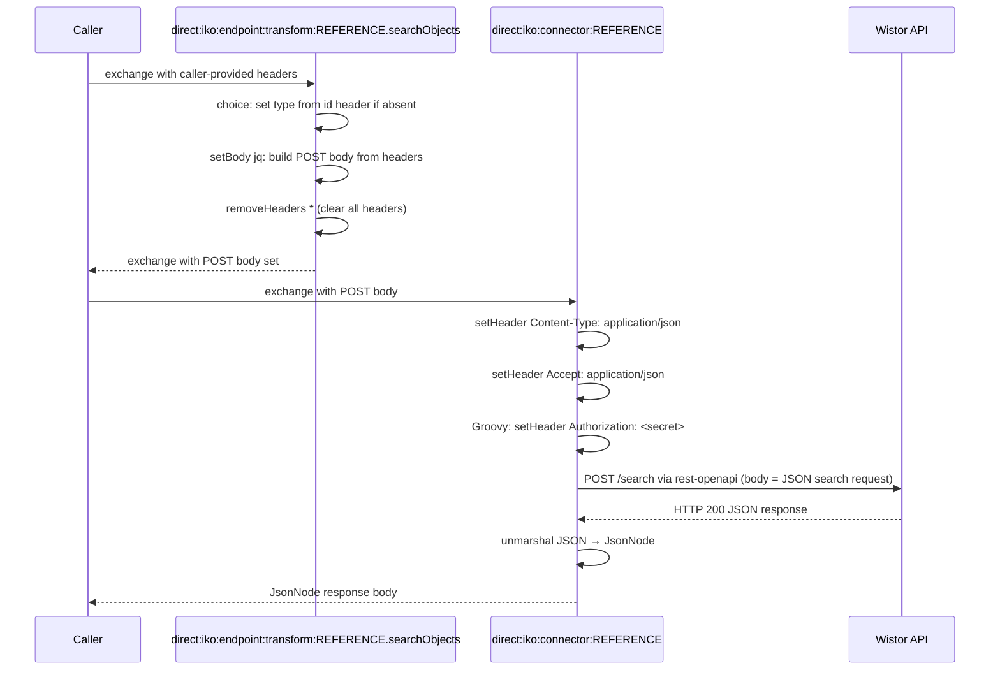

# Wistor

This connector talks to the Wistor IMBOR object-registration API (the *IMBOR Utrecht Test* API). It looks up property/value pairs for a single IMBOR object IRI (`getObjectInfo`), discovers the searchable types and filterable fields (`getSearchMetadata`), and runs filtered, scroll-paginated searches for IMBOR objects (`searchObjects`).

Authentication is a static AppID token sent verbatim in the `Authorization` header — the API does not use `Bearer`/JWT, it expects the raw AppID token string.

## Configuration

The configuration properties of wistor are:
- **host**: Base URL (e.g. `https://test.objectenregistratie.wistor.nl/servlets/cgi/io/IMBORUtrecht_Test`)
- **secret**: The AppID token to send in the `Authorization` header

These values are stored encrypted in the database (AES-GCM) and decrypted into the `configProperties` exchange variable at runtime.

The OpenAPI specification URL is set on the connector instance via the `apiSpecificationUrl` property. The repository ships a copy of the Wistor spec under [`doc/connectors/wistor/wistor-api-spec.yaml`](wistor/wistor-api-spec.yaml); point `apiSpecificationUrl` at a mounted copy (e.g. `file:/openapi-specs/wistor-api-spec.yaml`) or a remote URL.

## Endpoints

Wistor has the following endpoints:
- **getObjectInfo** — `POST /objectinfo`, returns SPARQL JSON property/value pairs for an object IRI
- **getSearchMetadata** — `GET /search`, returns available types, filterable fields, and return properties
- **searchObjects** — `POST /search`, searches objects of a type with optional filters and scroll pagination

Other endpoints can be found by inspecting the specification.

## Connector Code

Copy the connector code down below and replace the `REFERENCE` with the reference of the connector.

```yaml
- route:
      id: "direct:iko:endpoint:transform:REFERENCE.getObjectInfo"
      errorHandler:
          noErrorHandler: {}
      from:
          uri: "direct:iko:endpoint:transform:REFERENCE.getObjectInfo"
          steps:
              - choice:
                    when:
                        - simple: "${header.iri} == null"
                          steps:
                              - setHeader:
                                    name: "iri"
                                    jq:
                                        expression: ".idParam // header(\"id\") // empty"
                                        source: "variable:endpointTransformContext"
              - setBody:
                    jq: |
                        { iri: header("iri") } | with_entries(select(.value!=null))
              - removeHeaders:
                    pattern: "*"
- route:
      id: "direct:iko:endpoint:transform:REFERENCE.searchObjects"
      errorHandler:
          noErrorHandler: {}
      from:
          uri: "direct:iko:endpoint:transform:REFERENCE.searchObjects"
          steps:
              - choice:
                    when:
                        - simple: "${header.type} == null"
                          steps:
                              - setHeader:
                                    name: "type"
                                    jq:
                                        expression: ".idParam // header(\"id\") // empty"
                                        source: "variable:endpointTransformContext"
              - setBody:
                    jq: |
                        {
                           type: header("type"),
                           filters: (if (header("filters") != null) then (header("filters") | fromjson) else null end),
                           page: (if (header("page") != null) then (header("page") | tonumber) else null end),
                           pageSize: (if (header("pageSize") != null) then (header("pageSize") | tonumber) else null end),
                           scrollId: header("scrollId")
                        } | with_entries(select(.value!=null))
              - removeHeaders:
                    pattern: "*"
- route:
      id: "direct:iko:endpoint:transform:REFERENCE.getSearchMetadata"
      errorHandler:
          noErrorHandler: {}
      from:
          uri: "direct:iko:endpoint:transform:REFERENCE.getSearchMetadata"
          steps:
              - removeHeaders:
                    pattern: "*"
- route:
      id: "direct:iko:connector:REFERENCE"
      errorHandler:
          noErrorHandler: {}
      from:
          uri: "direct:iko:connector:REFERENCE"
          steps:
              - setHeader:
                    name: "Content-Type"
                    constant: "application/json"
              - setHeader:
                    name: "Accept"
                    constant: "application/json"
              - script:
                    groovy: |-
                        exchange.in.setHeader("Authorization", "${exchange.getVariable('configProperties', Map).secret}")
              - toD:
                    uri: "language:groovy:\"rest-openapi:${variable.configProperties.apiSpecificationUrl}#${variable.operation}?host=${variable.configProperties.host}\""
              - unmarshal:
                    json: {}
```

## Route Execution Flow

The diagram below shows the execution flow for a `searchObjects` call. The `getObjectInfo` operation follows the same pattern with a single-field body; `getSearchMetadata` is a GET with no body and only strips headers.



## Route anatomy

### Endpoint transform routes

**`choice: set iri / type if absent`** — Defaults the primary parameter (`iri` for `getObjectInfo`, `type` for `searchObjects`) from the `id` exchange header only when it is not already present. The `choice/when` block checks the header for null and, if true, evaluates the JQ expression `.idParam // header("id") // empty` against the endpoint transform context to default the value from the `id` exchange header (set from the `?id=` query parameter or `/{id}` path variable). See [Conditional header defaulting](README.md#conditional-header-defaulting-choicewhen) in the Route Anatomy Reference.

**`setBody: jq:`** — Builds the JSON request body the Wistor POST operations expect from exchange headers. `getObjectInfo` produces `{ iri }`; `searchObjects` produces `{ type, filters, page, pageSize, scrollId }`. The `filters` header is parsed from a JSON string via `fromjson`, `page`/`pageSize` are coerced with `tonumber`, and `with_entries(select(.value!=null))` drops any unset fields so optional parameters are omitted. `getSearchMetadata` is a GET and has no `setBody` step.

**`removeHeaders pattern: "*"`** — Strips all exchange headers before the HTTP call. Wistor takes its parameters in the JSON body (or none, for `getSearchMetadata`), so no headers need to survive as query parameters. See [`removeHeaders`](README.md#removeheaders-with-excludepattern) in the Route Anatomy Reference.

**`errorHandler: noErrorHandler: {}`** — See [`errorHandler`](README.md#errorhandler-noerrorhandler) in the Route Anatomy Reference.

### Connector route

**`setHeader Content-Type / Accept: application/json`** — Wistor consumes and returns `application/json`.

**`script: groovy:`** — Sets the `Authorization` header from the `secret` value in the encrypted connector instance config. Note the raw AppID token is sent verbatim — there is no `Bearer ` prefix.

**`toD: language:groovy: "rest-openapi:..."`** — See [`toD: rest-openapi:`](README.md#tod-languagegroovy-rest-openapivariabledoperationhosturl) in the Route Anatomy Reference. The named `operation` (`getObjectInfo`, `getSearchMetadata`, `searchObjects`) resolves to the HTTP method and path from the OpenAPI spec; the JSON body built by the endpoint transform becomes the POST request body.

**`unmarshal: json: {}`** — Parses the Wistor response into a Jackson `JsonNode` tree.
