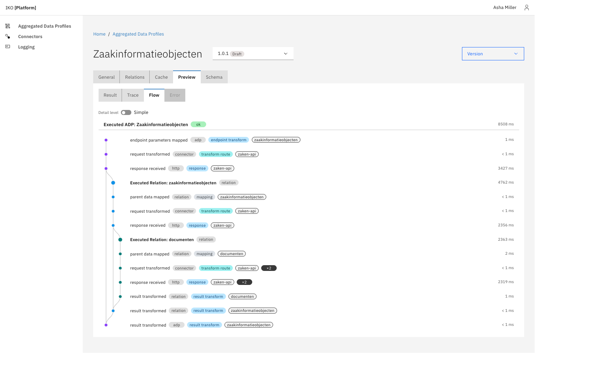

# Debugging a profile (Preview / Flow)

The **Preview** tab on a profile's admin page runs the profile against a real request and shows what happened, step by step. It is a diagnostic tool: it enables Camel's `BacklogTracer` for that one request, so it is admin-only, per-request, and does not affect normal API traffic.

## Running a debug

1. Open a profile in the admin UI and select the **Preview** tab.
2. Fill in the **Endpoint Transform Context** (the request parameters the profile expects, e.g. an `id`).
3. Click **Get results**.

The panel has four tabs: **Result** (the final JSON), **Trace** (the flat list of Camel events), **Flow** (the visual graph, described below), and **Error** (present only when the run failed).

## The Flow graph

The Flow tab renders the run as a vertical git-branch graph: time flows top→bottom, the trunk is the profile itself, and each relation splits off into its own branch and merges back when it completes.

- **Banner** — `Executed ADP: <name>` with the overall status and total elapsed time. Click it for the profile's input and final output.
- **Rails** — one coloured lane per branch. A relation splits off the operation that feeds it and merges back into the aggregation that combines it.
- **`start` markers** — where a branch begins.
- **`Executed Relation: <name>` headers** — the start of a relation's branch. Click a header for the relation's own result (post result-transform).
- **Row pills** — each step row carries a **layer** pill (`adp` / `connector` / `http` / `relation`), a **type** pill (e.g. `operation route`, `aggregation`, `result transform`), and an **entity** pill (the ADP name, connector tag or relation property).
- **`×N`** — an array/loop relation runs once per element; its per-element steps render inline within the relation branch with an `×N` pill (only when `N > 1`).
- **`failed`** — a red pill/ring marks the step that actually failed.

### Simple vs Advanced

The **Detail level** toggle switches between **Simple** (the entry, every transform/mapping and the HTTP call) and **Advanced** (every curated step, including the operation and aggregation nodes).

## The step modal

Clicking any step (or header) opens a modal with the step's pills and status plus two tabs:

- **Details** — per-type fields: the connector/instance/operation, the JQ expression and its context/result for transform steps, and for an HTTP call the method, status, outgoing URL, and outgoing/response headers and bodies.
- **Exchange** — the raw message **input** and **output** (body + headers) around the step.

JSON bodies are pretty-printed. Some in-memory bodies (the combined aggregation object) are captured as JSON during a debug run so they display as JSON rather than a Java `Map.toString()`.

### Header values

By default **all** header values are masked as `***` in the modal, so credentials (e.g. the generated `Authorization` bearer token) never reach the browser. Header names are always shown.

To show header values in full — useful in a **test environment** — set `iko.debug.show-headers` (env `IKO_DEBUG_SHOW_HEADERS`):

```yaml
iko:
    debug:
        show-headers: true
```

It is read once at startup. Because it exposes credentials in the trace, only enable it in non-production environments.

## Failure display

On a failed run only the step that threw (e.g. an HTTP call), the aggregations that fold its branch in, and the ADP banner are red; successful ancestor and sibling steps stay neutral. For nested relations each level has its own aggregation, so a failure in a nested relation reddens that relation's aggregation, then its parent's, up to the trunk — making the failing path easy to follow.


